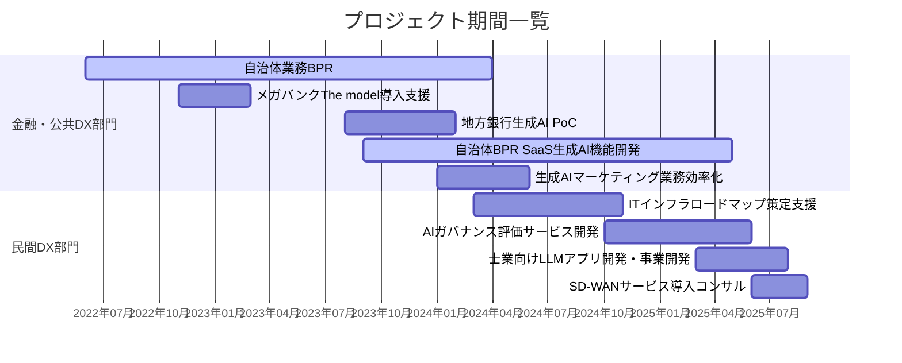

# 職務経歴書

## 職務要約
熊本大学大学院を卒業後、新卒で株式会社チェンジに入社。DX支援/ITサービス事業部の金融・公共DX部門に配属され、自治体業務のBPRやシステム標準化の支援業務に従事。学校関連業務の担当者、および町内会関連業務の副担当者として、検討から実行支援までを行った。また、その過程で、グループ会社の提供するBPRのSaaSおよび組織のスキル不足の課題を認識する。解決に向けて生成AIや自然言語処理を利用できないか自身で検証し、一定の手ごたえを感じたため、SaaSの改修について自らグループ会社に提案を行う。無償のPoC期間を経て、正式にプロジェクトの受注を獲得。単独でデリバリーを実施し、3回の契約更新を挟み、1年で2つの機能のリリースを実現する。
ITインフラ系のプロジェクトのアサインを契機に、民間DX部門に配属。インフラ機器ベンダーのコンサルティングチームの一員として、ベンダー顧客のITインフラ戦略策定を行うワークショップの運営に携わる。半年間で、電力会社、製造業グローバルコングロマリット、公益社団法人のITインフラ戦略策定に携わる。そして、同ベンダーのAIガバナンス評価サービスの企画・開発に携わり、評価チェックシートの作成、評価結果を実行計画に落とし込むサービス設計を中心となって担当する。
その後、士業向けの生成AI組み込みSaaS事業の計画やプロダクト開発、PoCの実施、製造業グローバルコングロマリットの社内向けITインフラサービスの展開に向けた検討に携わる。

## 活かせる経験・能力・知識・技術

1. 課題発見から成果までを推進する企画・実行力
現状の課題を分析し、テクノロジー（特に生成AI）を活用した解決策を自ら企画・提案し、PoCから実装、事業化検討までを一気通貫で推進できます。
実績例:
    * 自治体向けSaaSのデリバリー品質課題に対し、自ら生成AI機能の開発を提案。単独でPoCからプロジェクト受注、2つの主要機能リリースまでを実現しました。
    * 士業向けSaaSの事業アイデアを起点に、単独でヒアリング、プロトタイプ開発、PoC、事業計画策定までを完遂しました（事業化は見送りも、一連のプロセスを経験）。
    * 社内マーケティング業務の課題に対し、生成AI活用を提案・実行し、LP用画像制作の大幅な効率化（期間短縮・コスト削減）を実現しました。

2. 生成AIに関する深い知見とビジネス実装の経験
生成AIの技術トレンドを常に追い、RAG等の最新技術を用いたシステム設計・開発から、AIガバナンスの設計まで、ビジネス価値創出に繋げることができます。
実績例:
    * 開発・コンサルティング: RAGを用いた金融機関向け問い合わせ業務効率化PoCのリード。自治体向けSaaSへの機能実装（プロンプト設計、データ分析、開発）。
    * 企画・サービス設計: ITインフラベンダーにおけるAIガバナンス評価サービスの企画・設計（評価シート作成、実行計画モデル構築）。
    * 客観的評価・自己研鑽: SignateのRAGシステム構築コンペで上位入賞（500人中24位、銀メダル）。毎月投資を行い、最新ツール（ChatGPT, Gemini, Cursor等）を業務に徹底活用しています。

3. 未経験領域をキャッチアップし、価値を創出するコンサルティング能力
未知の領域であっても、迅速に知識を体系化し、早期に戦力となることができます。ITインフラやアプリケーション開発など、専門外の分野でも主体的な学習と実践を通じて短期間で成果に結び付けてきました。
実績例:
    * BPRコンサルティング: 自治体業務のプロセスを分析し、制度の簡素化と電子化を実現。メガバンクの営業プロセス改革を支援。
    * ITインフラコンサルティング: 未経験からITインフラの知識を習得し、大手電力会社や製造業のインフラ戦略策定を支援。顧客から個人指名で評価を獲得し、別プロジェクトへ繋げました。
    * システム・アプリ開発: 学生時代に学習したPythonに加え、TypeScript、SQL、AWSの知識を学習し、士業向けのアプリケーションを開発。DifyやPowerAutomateなどのワークフローツール、GoogleやBoxのAPIも活用しました。

## 職務経歴詳細
### 会社名
株式会社チェンジ

### 雇用形態
正社員

### 在籍期間
2022年4月 ～ 現在

### プロジェクト概要

### プロジェクト一覧
| 期間 | プロジェクト名・内容 |
|------|---------------------|
| **2022年6月～2024年3月** | **金融・公共DX部門** 自治体業務のBPRやシステム標準化の支援業務、SaaSの生成AIやデータ活用の開発支援 |
| 2022年6月～2024年3月 | **1. 自治体 業務BPR** 役割: プロジェクトメンバー（12名） 担当業務: BPRの検討、ファシリテーション、報告書作成 内容: システム標準化に関する支援業務、都内２区の自治体業務の効率化と業務フローの見直しを推進。BPRの検討～実行支援を実施。町内会関連の申請業務ではデジタルへの抵抗や会計の差戻し基準のブレ、学校関連の人事業務では校務NWの制約や他部署との連携の不足、といった課題に対して一つ一つ対応を担当者と議論し、制度の簡素化と電子化を実現した。 |
| 2022年11月～2023年2月 | **2. メガバンク The model 導入計画検討支援** 役割: プロジェクトメンバー（3名） 担当業務: 計画内容の検討、および関連資料の作成 内容: 顧客の中期経営計画において、法人営業活動のデジタル化が掲げられ、その中でもSMEマーケットに対する営業のデジタル化・非対面化が重要なテーマとして位置付けられていました。これを受け、The modelの導入、ならびにそれに伴う営業プロセスおよび役割に関する検討を実施しました。複数の商材が存在し、それぞれ異なる担当者およびトスアップフローが存在していたため、これらを整理し、新たな制度に合わせた担当者割り当てと業務フローの整理を行いました。 |
| 2023年8月～2024年1月 | **3. 地方銀行 生成AIツールによる問い合わせ業務の効率化のPoC** 役割: プロジェクトリード（4名） 担当業務: プロジェクトマネジメント 内容: 金融機関の窓口で発生する問い合わせ業務について、社内規程等のドキュメントを用いたRAG（Retrieval-Augmented Generation）機能の実証と評価。プロジェクトマネージャーとして、ステークホルダーとのコミュニケーションを担い、他のメンバーと協力してプロジェクトを進めました。生成AI自体の理解や業務活用の方法について事例がない中、自身でも業務で積極的に生成AIを活用することで、ベンダーや顧客との円滑なやり取りを行い、PoCを完遂しました。 |
| 2023年9月～2025年4月 | **4. 自治体BPR SaaSの生成AI機能開発** 役割: プロジェクトメンバー（1名） 担当業務: サービス設計、アプリ機能開発のコンサルティング、開発、検証 内容: 自治体BPR事業において、経験豊富なメンバーの不足によりデリバリー品質低下が課題となっていました。複数のBPRに携わる中で、分析・検討内容に類似点があること、およびそれらをデータとして蓄積しパターン化することで、時間短縮と品質向上が見込めると認識しました。さらに、生成AIがそのパターンを個別化する上で有効であると実感していたため、既存SaaSの新規機能としてそれらを開発することを自ら提案、単独でデリバリーしました。半年の検証期間と1年間のプロジェクト期間、および3回の契約更新を経て、業務手順書生成機能とBPR自動分析機能の2つの主要機能をリリースしました。BPRおよびLLMの専門家として、プロダクトマネージャーとの壁打ちを行い、AI実装の方向性議論、機能検証・開発、プロトタイプ作成を推進しました。プロダクトへの実装はベンダーに引き継ぎ、関連タスクを遂行しました。プロンプト作成や機能設計に加え、自然言語処理を用いた既存テキストデータの分析と活用検証（Pythonによる形態素解析、傾向分析、モデル構築、レコメンド機能開発）も実施しました。 |
| 2024年1月～2024年5月 | **5. 生成AIを活用したマーケティング業務の効率化** 役割: プロジェクトメンバー（2名） 担当業務: PoC、社内業務改善提案 内容: 社内向け生成AIツールの提案を契機に、社内マーケティング責任者とプロジェクトを発足し、生成AIを活用したマーケティング業務の効率化を実現しました。具体的には、LP掲載用の画像生成の内製化を実現し、制作期間を大幅に短縮、委託費を削減しました。研修をセールスするLPにおいて、研修内容や伝えたいメッセージを表現する抽象画像が必要でした。マーケティング担当者自身もイメージが固まっておらず言語化が困難であったこと、また外注先も研修内容を十分に理解しておらず、外部との複数回のやり取りを要し、数週間の制作期間を要していました。この課題を解決するため、ChatGPTやStable Diffusionを活用し、抽象画像を検討するプロセスを分解・言語化するコンサルティングを実施することで、最短当日での納品を実現しました。画像生成AIが社内に普及するまでの期間、本業務を4案件請け負い、現在も担当した4つのLPが公開されています。 |
| **2024年4月～現在** | **民間DX部門** ITインフラの戦略策定ワークショップの運営や検討、生成AIアプリケーションの開発やPoCの実施、AIガバナンス評価サービスの企画・設計に携わる |
| 2024年3月～2024年10月 | **6. ITインフラのロードマップ策定支援** 役割: プロジェクトメンバー（4名） 担当業務: 計画策定、資料作成 内容: ITインフラ機器ベンダーの業務メンバーとして、ベンダー顧客のITインフラロードマップ策定を目的としたデザイン思考ワークショップの運営支援に従事しました。大手電力会社、製造業コングロマリット、公益社団法人の3社に対し、中期経営計画およびITインフラのトレンド分析、意見のクラスタリングとワークショップ設計への反映、ITインフラロードマップへの落とし込み、資料作成などを担当しました。ITインフラに関する知識・経験が不足していた状況から業務を開始したため、過去に実施された10弱のワークショップ内容を確認し、抽出された意見とクラスタリング手法を全てExcelに転記してパターン化を図りました。また、ソリューションの軸となるベンダー製品を整理した上で業務を遂行しました。この地道な取り組みが評価され、プロジェクトマネージャーの交代時においても、私個人を指名してご評価いただき、その結果、プロジェクト⑨への参加に繋がりました。 |
| 2024年10月～2025年5月 | **7. AIガバナンス評価サービス開発** 役割: プロジェクトメンバー（2名） 担当業務: サービス企画、評価シート作成、ロードマップ策定サービス設計 内容: ITインフラ機器ベンダーが提供するAIガバナンス評価サービスの開発を担当しました。主に、コンテンツの責任者として、ガバナンス評価シートの作成、およびその結果に基づいたロードマップ策定サービスの設計に従事しました。日常的に生成AI関連のニュースを追っていたことから国内の状況は概ね把握しており、米国やEUにおけるAIガバナンスなど、海外の状況を中心にリサーチを実施。日米の複数の評価指標を掛け合わせ、必要な項目を整理した上で評価シートを作成しました。また、評価項目に基づいた実行計画モデルを構築し、各項目に対応するベンダーソリューションとの連携を行いました。 |
| 2025年3月～7月 | **8. 生成AIを活用した士業向けLLMアプリケーション開発・事業開発** 役割: プロジェクトリード（1名） 担当業務: 業務課題ヒアリング、アプリ要件整理、プロトタイプ作成、PoC実施、事業計画書作成 内容: 社長からの「中小企業診断士の経営改善計画書作成業務における生成AIによる効率化」というご依頼に対し、アプリ開発からPoC実施までの一連の業務を単独で担当しました。まず、業務と課題のヒアリングを実施し、関連制度の資料や実際の成果物を精査することで、業務フローおよびデータフローを整理しました。その上で、既存業務のどの部分に生成AIを適用すべきかを検討し、Microsoft PowerAutomateとPowerAppsを用いてMVPを作成し、中小企業診断士の方々と方向性を確認しました。しかし、この段階でツールの限界を認識したため、PoC版アプリケーションの開発に着手しました。アプリケーション要件を検討しながら、TypeScript、PostgreSQL、Difyを用いて開発を進め、α版を完成させました。同時に事業計画書を作成し、役員会議にて発表を行いました。複数回のヒアリングを通じて機能を改良し、実際に操作してのフィードバックを得る段階まで進展したため、AWSに移行したβ版として提供し、テスト利用を実施しました。機能改善を継続する中で、別の会計士の方とのヒアリングにおいて「部分的な効率化に留まるのではないか」とのご意見をいただきました。部分的な効率化であっても一定の月額使用料を頂戴できる可能性はありましたが、業務の大幅な効率化が図れない点、事業規模が小さい点、および組織体制が未整備である点を考慮し、事業化は断念するという結論に至りました。 |
| 2025年6月～8月 | **9. 製造業コングロマリットの社内インフラサービス展開、SD-WANサービス導入に向けたコンサルティング** 役割: プロジェクトメンバー（2名） 担当業務: リサーチ、内容検討、資料作成 内容: グローバル製造業コングロマリットでは、社内向けSD-WANサービスを開発したものの、各グループ会社への導入が進まないという課題に直面していました。この課題に対し、サービスの意義とメリットの再評価、セグメンテーションの事例調査と検討を実施し、新たなセグメンテーションモデルを提案しました。プロジェクトメンバーとして、調査、分析、資料作成を担当しました。プロジェクト開始時にはITインフラの知識が不足していたため、不明な用語があった際には生成AIも活用しながら前提や概念から必ず確認し、自身の理解を壁打ちすることで短期間でのアウトプットに結びつけることができました。 |

## 強みと改善点

### 強み
- プロジェクトの推進力：これまで自主的に自社にとって必要だと思った活動を行ってきたし、未経験の領域でも必要に応じて社内メンバーに相談してキャッチアップをしながらデリバリーを行ってきた。対応できる業務の幅が広がってきているし、仮に未経験の領域に取り組む際にもこれまでと同じようにやればよいと思っているし、過去の経験から自分にはそれができると信じている。

### 改善点
- 仕事モードに入るとスイッチが入ってしまい、円滑なコミュニケーションができていないことがある。特に社内だと遠慮がなくなってしまい、議論になると相手を言い負かそうみたいになってしまうことがある。できているかは別として、その意味でDeNAの南場さんの「事に向かう」という言葉が大事で意識していきたい。

---

## キャリアプラン

必ずしも転職したいわけではなく、良い求人があれば検討したいくらいの温度感。
AIの領域で広げていきたいと考えていて、これまでのアサイン調整、経験でも、実現してきている。そもそも、プロダクト方面でSaaS企業にいくか、コンサルティング方面で他のファームにいくかでも悩んでいて、今の環境は一定の水準ではそれが両立できている。一方で、プロダクト方面はほぼ一人でやらないといけないし、コンサルティングもサブコンもしくはコンサルティングプロジェクトに一人でアサインされている状況であり、より実力を付けやすい環境があれば検討したいと考えている。
現状弱い力としては顧客折衝（セールス、交渉力、事業価値の訴求等）であると考えていて、顧客への貢献を考える上で欠かせない力なので重要であり、テクノロジーの知識と比較して自学に限界があると思うので、そこに向き合えるような環境で働きたい。
次の9月中旬～11月前後、次の次の1月はプロジェクトのアサインの予約が入っていて、それなりには評価されているので時間をかかるかもしれないが、堅調にキャリアアップしていけるとは考えている。

---

## 成長を実感したタイミングとやりがい

これまでのキャリアの中で、特に成長を実感した瞬間は、税理士や中小企業診断士向けの業務用アプリケーション開発のプロジェクトを、困ったり詰まったりした際には社内メンバーに聞きながら、一人で全て進めている時です。これらの経験を通じて、自分のスキルや知識が実務に直結し、成果として形になっていることを実感できました。

また、これまでの多くの経験—BPRのプロジェクトやITインフラの戦略策定、SaaS開発、社内の生成AIを活用した業務改善やツール開発など—が一つの流れとして繋がり、自分の成長に直結していると感じています。これらの経験を狙って積み重ねてきたことも、自信とやりがいにつながっています。

やりがいについては、「次の仕事をもらえる」「自分の名前で指名される」ことに大きな喜びを感じます。直接感謝されたり、褒められたりすることは必ずしも多くありませんが、その代わりに認めてもらえた結果として次の仕事や依頼が来ることが多いです。「実際の予算確保まではできていないが、いっしょに○○をやりたい」と声をかけてもらえることも非常に励みになります。

これらの経験や評価を通じて、もっと成果を出すために成長し続けようと意欲が高まります。

---
# AIサービスの利用状況、経費申請の可否について知りたい。

# どこでどうやって事業成長しようとしていて、チームはどのように位置づけられているか？

# チームの一番の（事業、組織の）課題は何か？

# 活躍している人の特徴は？